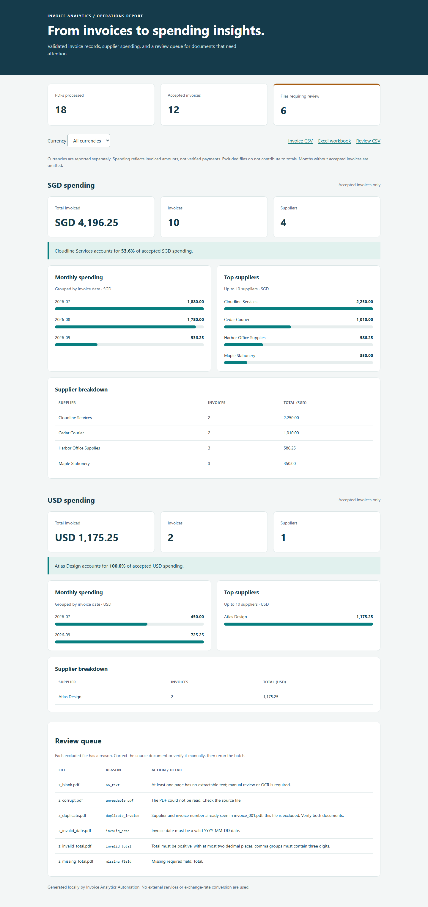

# Invoice Analytics Automation

Turn a folder of supplier invoices into validated spreadsheet records and a
spending report. The application extracts fields from supported PDF layouts,
flags documents that need review, and summarizes accepted invoices by currency,
month, and supplier.

A local browser workspace also supports document preview, corrections, explicit
approval or rejection, saved decision history, and exports from approved records.



## AI-assisted development

This portfolio project was developed with substantial AI assistance, including
the implementation, automated tests, documentation, and demonstration assets.
The project direction and scope were selected by the author, with AI used to
help build the working application.

The initial version is prepared for publication as a single baseline commit.
That commit captures the completed initial implementation; the repository's
history does not document the intermediate AI-assisted development steps.

Invoice processing itself uses explicit parsing and validation rules. Running
the application does not call an AI model or require an AI subscription.

## Business problem

Operations teams often receive invoices as PDFs but track spending in Excel.
Copying invoice details manually is repetitive, while missing values and
duplicates can distort reports. This project automates extraction and reporting
and keeps a review queue for documents that do not meet its validation rules.

**Implemented scope:** batch processing for two documented, selectable-text
invoice layouts. The included demonstration uses fictional data. See the
[project brief](docs/PROJECT_BRIEF.md) for the business context, findings, and
limitations, and the [architecture](docs/ARCHITECTURE.md) for design decisions.

## Features

- Extract invoice number, supplier, date, currency, and total from two layouts.
- Validate required fields, dates, currency codes, and positive decimal amounts.
- Detect duplicate supplier/invoice-number pairs and conflicting values.
- Continue processing other files when a PDF is unreadable or fails validation.
- Export accepted records and review reasons, with source filenames for traceability.
- Produce a formatted Excel workbook and an offline HTML dashboard with a currency filter.
- Calculate spending by supplier and month without combining currencies.
- Rebuild reports on every run, with command exit statuses suitable for scheduled jobs.
- Evaluate extraction and rejection behavior against separately authored PDF fixtures.
- Review PDF originals alongside editable fields, with notes for corrections and rejections.
- Save review progress locally and download complete, versioned report bundles.

## Review invoices in the browser

From the repository root, install or update the environment and start the local
review application:

```powershell
python -m venv .venv
.\.venv\Scripts\python.exe -m pip install -r requirements.txt
.\.venv\Scripts\python.exe -m invoice_analytics.review_app
```

Open **http://127.0.0.1:8765** in your browser. If the environment is already set
up, run just the last command. Keep the terminal running while using the screen;
press `Ctrl+C` to stop it. To use another port, add `--port 8766`.

1. Load the demonstration batch or select your own PDFs. Uploads are copied into
   local storage; the source files on your computer are not changed.
2. Select a document to see its PDF, extracted fields, and original extraction
   issue. Every document starts pending. Nothing contributes to spending until
   it is approved.
3. Compare each value with the source. Correct fields when you can verify the
   correct value, add a note, then approve. Missing values remain blank and
   ambiguous values are not guessed. Rejections also require a note.
4. For the included demo, the bulk approval action accepts the 12 validated
   records. Inspect the remaining six flagged records and reject those without
   a verifiable correction. Unreadable, encrypted, or textless documents must be
   rejected and replaced with readable PDFs.
5. Resolve conflicting copies by approving at most one invoice per supplier and
   invoice number, with an explanation, and rejecting the other copies. Duplicate
   checks are also applied after editing the identity fields.
6. Once every record is approved or rejected, export the reviewed batch. Download
   the complete ZIP, or individual CSV, Excel, HTML, JSON, and decision-history
   files. Unzip the bundle before opening its dashboard so download links work.
7. Reopen an approved or rejected record to change its decision. Earlier exports
   retain the values and decisions at the time they were created; export again
   after completing the new review.

The batch selector restores saved progress after restarting the application.
All uploads, decisions, and export snapshots are stored in `.invoice-review/`,
which is excluded from Git. The screen is a single-user tool bound to your own
computer; it has no accounts or hosted service. Use one storage directory per
workspace. `--data-dir` selects a different local folder; keep custom folders
containing private invoices outside your public repository.

Uploads are limited to 100 PDFs, 10 MB per file, and 50 MB per request. Filenames
are sanitized for local storage and must remain unique; the original uploaded
name is retained in the decision history. Invoice fields can be edited up to
200 characters, and notes up to 2,000 characters. Decisions from an outdated
browser tab are rejected with a message to reload the batch.

| Workflow | Which invoices enter reports? | Output behavior |
| --- | --- | --- |
| Command line | Validated records without duplicate conflicts | Replaces the five files in the chosen output folder |
| Browser review | Explicitly approved records after every record has a decision | Creates a separate immutable snapshot and a decision-history JSON |

## Quick start

Requires Python 3.10 or newer. Run commands from the repository root.

### Windows PowerShell

```powershell
python -m venv .venv
.\.venv\Scripts\python.exe -m pip install -r requirements.txt
.\.venv\Scripts\python.exe -m invoice_analytics --input data/samples --output outputs
Start-Process .\outputs\dashboard.html
```

### macOS / Linux

```bash
python3 -m venv .venv
.venv/bin/python -m pip install -r requirements.txt
.venv/bin/python -m invoice_analytics --input data/samples --output outputs
```

Open `outputs/dashboard.html` in a browser. No web server, account, API key, or
network connection is required after installation. The sample batch intentionally
contains a corrupt PDF; a PDF-library warning during this demo is expected.

Alternatively, install the package with `python -m pip install .` inside your
environment, then use `invoice-analytics --input data/samples --output outputs`.

## Demo walkthrough

After completing setup, use this sequence from the repository root. The same
virtual environment can be reused on subsequent runs.

1. Open `data/samples/invoice_001.pdf` in a PDF viewer. Identify its invoice
   number (`INV-001`), supplier (`Harbor Office Supplies`), date (`2026-09-01`),
   currency (`SGD`), and total (`125.50`). These are the fields the tool extracts.
2. Run the batch in PowerShell:

   ```powershell
   .\.venv\Scripts\python.exe -m invoice_analytics --input data/samples --output outputs
   ```

   `--input` selects the folder of PDFs. `--output` selects where reports are
   saved. Expect 18 processed files, 12 accepted invoices, and 6 review files.
3. Open the dashboard:

   ```powershell
   Start-Process .\outputs\dashboard.html
   ```

   Inspect the processing counts, select SGD or USD using the currency filter,
   and review spending by month and supplier. Scroll to the review queue to see
   why files were excluded. Currency selection filters the spending sections;
   the processing counts and review queue always describe the entire batch.
4. Open `outputs/invoices.csv` and find `invoice_001.pdf`. Compare its row with
   the source PDF. Then open `outputs/review.csv`: `z_duplicate.pdf` should be
   flagged as a duplicate, and `z_missing_total.pdf` should have a missing-field
   reason. The six review cases are intentional demonstration inputs.
5. Open `outputs/spend_report.xlsx` in Excel or another compatible spreadsheet
   application. Its five sheets contain accepted invoices, review details,
   currency totals, monthly spending, and supplier spending. `summary.json`
   contains the aggregate data in a format other programs can read.

The dashboard also links to the CSV files and Excel workbook. To process a
different batch, change `--input` to its folder and rerun the command. Close
the workbook first, then refresh the browser to see the regenerated report.

## Demonstration results

| Result | Value |
| --- | --- |
| PDF files processed | 18 |
| Accepted invoices | 12 |
| Files requiring review | 6 |
| Accepted SGD spending | 4,196.25 |
| Accepted USD spending | 1,175.25 |

The review cases cover a duplicate, a missing total, an invalid date, a negative
total, a blank PDF, and a corrupt PDF. The reference records are committed in
[`data/expected_invoices.csv`](data/expected_invoices.csv) and
[`data/expected_review.csv`](data/expected_review.csv).

Browse the [sample report files](examples/report), including the
[invoice CSV](examples/report/invoices.csv), [review CSV](examples/report/review.csv),
and [summary JSON](examples/report/summary.json). Download the sample report
folder to open its HTML dashboard locally; GitHub's file view does not run it.

## Outputs

| File | Contents |
| --- | --- |
| `invoices.csv` | Validated invoice records, source filenames, and detected layouts |
| `review.csv` | Excluded files, reason codes, and review details |
| `spend_report.xlsx` | Invoices, review queue, currency totals, monthly and supplier summaries |
| `dashboard.html` | Offline report with charts, supplier tables, and review details |
| `summary.json` | Counts and currency-specific aggregates for downstream use |

Every run replaces these five files in the selected output folder. It does not
append invoices or maintain a history. Close the generated workbook before
rerunning. Keep the five files together so dashboard download links work.
CSV and JSON amounts retain two decimal places. CSV text that resembles a
formula is prefixed with an apostrophe for spreadsheet safety.

This replacement behavior applies to the command-line workflow. Browser review
exports keep separate snapshots and additionally include `review_decisions.json`
with original and corrected fields, decisions, notes, and timestamps. For those
exports, `review.csv` lists manually rejected records and the dashboard labels
them as rejected. The shared `summary.json` key `review_files` counts excluded
records; in a completed browser export those are all rejected records.

`review_decisions.json` also contains extracted document text and uploaded
filenames so decisions can be traced to their source. Treat the audit file and
complete ZIP as private invoice data. Review their contents before sharing an
export outside your organization.

## Process your own files

```powershell
New-Item -ItemType Directory -Force data/private | Out-Null
# Put your supported invoice PDFs in data/private before running this command.
.\.venv\Scripts\python.exe -m invoice_analytics --input data/private --output outputs
```

Create `data/private/` and put your PDFs there. It is excluded from Git, as are
the generated `outputs/` and virtual environment. PDF discovery is limited to
the immediate input folder, with case-insensitive `.pdf` extensions. Paths are
relative to the current terminal directory; absolute paths also work.

Each PDF must contain one invoice with one of these label sets. Each field must
be on its own extracted-text line in `Label: value` form.

| Field | Standard layout | Vendor layout |
| --- | --- | --- |
| Invoice number | `Invoice Number:` | `Invoice ID:` |
| Supplier | `Supplier:` | `Vendor:` |
| Date | `Invoice Date:` | `Issued:` |
| Currency | `Currency:` | `Currency:` |
| Total | `Total:` | `Amount Due:` |

Dates must use `YYYY-MM-DD`. Supported currencies are SGD, USD, EUR, GBP, AUD,
and CAD. Totals must be positive with at most two decimal places; `1,234.50`
is accepted. Repeated labels, missing fields, invalid values, unsupported
layouts, encrypted PDFs, and pages without text require review. No OCR is used.

Duplicate detection compares supplier and invoice number without case
sensitivity. When all matching records agree on date, currency, and total,
the first file in filename order is retained and later copies are excluded.
If any matching record disagrees on those values, **every invoice in that group
is excluded from spending totals** and marked `conflicting_duplicate` in the
review report. The review details identify the related source files.

For example, two invoices for the same supplier and invoice number showing
SGD 125.50 and SGD 999.00 both require review. Neither amount is accepted just
because its file was processed first. This also applies if a third file is an
exact copy of one of those conflicting invoices.

To resolve a conflict, verify the documents and create a corrected input batch
containing only the authoritative invoice for that identity, then rerun the
command. Retain the original documents separately for reference. There is no
deduplication across runs.

### Exit statuses

| Status | Meaning |
| --- | --- |
| `0` | Reports generated; inspect the review count for excluded files |
| `1` | Input or report-writing failure |
| `2` | Invalid command arguments, or review files found with `--fail-on-review` |

Use `--fail-on-review` when a scheduler should flag an incomplete batch.
Reports are still generated when that flag returns status 2. If every file is
rejected, the dashboard shows an empty-data message and the complete review queue.

## Project structure

```text
invoice_analytics/       Extraction, validation, reports, CLI, and review service
invoice_analytics/templates/ Browser review page
invoice_analytics/static/    Local styles and browser behavior
data/samples/           Fictional PDFs, including intentional review cases
data/expected_*.csv      Reference values used by tests
data/evaluation/        Separately authored PDFs, expected results, and provenance
examples/report/        Committed sample outputs for portfolio review
examples/evaluation.json Recorded results for the separate evaluation set
docs/                   Project brief, architecture, and dashboard preview
tests/                  Automated behavior and report checks
tools/generate_samples.py
tools/build_evaluation_fixtures.py
tools/evaluate.py
.github/workflows/tests.yml
pyproject.toml
requirements.txt
requirements-dev.txt
```

## Development and verification

```powershell
.\.venv\Scripts\python.exe -m pip install -r requirements-dev.txt
.\.venv\Scripts\python.exe -m unittest discover -s tests -v
```

Tests cover expected extraction values, both layouts, invalid inputs, duplicate
conflicts, encrypted files, currency totals, exports, reruns, escaping, and exit
statuses. GitHub Actions is configured to run the suite on Python 3.10 and 3.14.

The fictional PDFs are included. To regenerate them and refresh the committed
demonstration reports after changing the fixtures:

```powershell
.\.venv\Scripts\python.exe tools/generate_samples.py
.\.venv\Scripts\python.exe -m invoice_analytics --input data/samples --output examples/report
```

### Evaluate extraction on separate fixtures

The original demo PDFs are generated from their expected CSV values. A second
fixture set in [`data/evaluation/`](data/evaluation/README.md) uses separately
authored PDF content and a different creation path. Its expected results are
maintained in a separate JSON file; the fixture builder never reads that file
or the demo CSV. Tests read the committed PDFs without regenerating them.

Run the evaluation from the repository root:

```powershell
.\.venv\Scripts\python.exe -m tools.evaluate --output outputs/evaluation.json
```

The report separates correct extraction, correct rejection, incorrect
acceptance, incorrect rejection, incorrect field values, and wrong rejection
reasons. Field matching uses the five business fields from every document
expected to be accepted. A supported document that is incorrectly rejected
still contributes five expected fields, so rejection cannot inflate the score.
Detected layout and source filename are also checked for each accepted record.

Cases cover both supported layouts, reordered fields, case and whitespace
variations, thousands separators, multiple pages, unsupported labels, repeated
fields, a missing total, and an invalid date. A mismatch causes a nonzero exit
status, as does an invalid fixture inventory. GitHub Actions runs this evaluation
alongside the test suite.

The [recorded evaluation](examples/evaluation.json) contains these results for
the eight included fixtures:

| Check | Result |
| --- | --- |
| Supported invoices extracted with all expected values | 4 / 4 |
| Invalid or unsupported invoices rejected for the expected reason | 4 / 4 |
| Matching business fields across expected valid invoices | 20 / 20 |
| Incorrect extraction, acceptance, rejection, or rejection reason | 0 |

These are synthetic fixtures created with AI assistance, independent of the
original demo generator. They are not real supplier documents or an independent
human validation study. Results describe this small contract evaluation and
must not be presented as general invoice extraction accuracy.

## Scope and limitations

The supplied fixtures demonstrate supported behavior; they do not establish
accuracy on arbitrary supplier documents. Scanned invoices, handwriting, line
items, tax reconciliation, payment matching, exchange-rate conversion, and
supplier alias matching are outside the current scope. The tool validates field
structure but cannot verify that an invoice is authentic or that its amount is
correct against a purchase order.

Spending is based on invoice dates and accepted amounts, not confirmed payments.
Missing months are omitted from charts. The demo is a small synthetic dataset,
so its findings are illustrative rather than evidence about an actual business.
