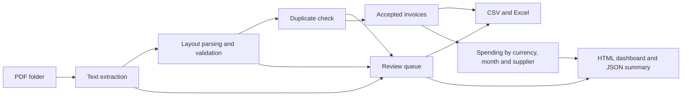

# Architecture and design decisions

## Business workflow

An operations analyst receives supplier invoices and needs a spreadsheet for
reviewing spending. The application turns a folder of supported PDF invoices
into validated records, a review queue, and an aggregated report in one command.

## Modules

| Module | Responsibility |
| --- | --- |
| `cli.py` | Parse command arguments, report batch results, return exit status |
| `extraction.py` | Read PDF text, recognize supported labels, validate required fields |
| `models.py` | Define invoice and review records shared by other modules |
| `pipeline.py` | Discover PDFs, isolate expected file failures, detect duplicates |
| `reporting.py` | Aggregate accepted records and write CSV, Excel, JSON, and HTML |

The application runs locally. Its processing path makes no network calls and
requires no credentials, server, database, or paid API. The HTML dashboard uses
embedded styles and a small currency filter; it loads no external assets.

## Validation contract

One invoice per PDF is supported. All five business fields are required:
invoice number, supplier, invoice date, currency, and total. Dates must be valid
`YYYY-MM-DD` dates. Currency codes are normalized to uppercase and restricted
to SGD, USD, EUR, GBP, AUD, and CAD. Amounts must be positive, at most
999999999999.99, and have at most two decimal places. Commas must form groups
of three digits. Currency symbols, scientific notation, credit notes, and
European decimal-comma notation are excluded.

Each field must appear once on its own extracted-text line as `Label: value`.
Surrounding whitespace is removed, consecutive whitespace is collapsed, and
labels are matched without case sensitivity. Repeated fields are rejected
rather than selecting an arbitrary value. PDFs with encrypted content or any
page lacking extractable text are sent for review. A scanned page with a text
header may instead fail required-field validation; no OCR is attempted.

Only the first validation failure per file is reported. Unexpected programming
errors are allowed to fail the run rather than being mislabeled as bad invoices.

## Duplicate policy

The identity is the normalized supplier name plus invoice number, compared
without case sensitivity. Files are processed in filename order. The first
valid occurrence is retained; later occurrences are excluded. A later record
with different date, currency, or total receives `conflicting_duplicate`.
The message identifies the earlier file so both can be reviewed.

This assumes a supplier does not reuse invoice numbers within the batch. It
does not match supplier aliases, establish supplier legal identity, or remember
invoices from previous runs. A conflict does not retroactively remove the first
record: reports are provisional until review is complete.

## Monetary calculations and analysis

Amounts are parsed and summed using Python `Decimal`. CSV and JSON contain
amounts with two decimal places. Excel receives numeric cells for usability;
its numeric storage and display follow Excel's precision limits. Use the CSV
or JSON when exact textual decimal values are required.

Currencies are never combined or converted. Monthly spending uses the invoice
date; months with no accepted invoices are omitted. Supplier labels are grouped
without case sensitivity, retaining the first encountered spelling. Spending
means invoiced value, not paid cash flow or independently reconciled expense.

## Exports and repeatability

Every accepted row retains its source filename and detected layout. CSV text
that could be interpreted as a spreadsheet formula receives an apostrophe
prefix; Excel text cells are explicitly stored as strings. Dashboard text is
HTML-escaped. These protections keep extracted content from becoming formulas
or HTML markup in the generated reports.

Each run rebuilds all five reports from the current input folder. Files are
generated in a temporary folder before replacement begins. Each individual
replacement is atomic on the same filesystem, but replacement of the complete
five-file set is not a filesystem transaction. Close open Excel workbooks before
rerunning. An interrupted replacement can leave a mixed report set; rerun the
batch before relying on it. A failed input scan leaves any previous reports in
place; check the command's exit status.

## Verification scope

The test suite checks both layouts, known reference values, validation errors,
encrypted documents, duplicate conflicts, currency separation, spreadsheet and
HTML escaping, reruns, and CLI exit statuses. Included fixtures are synthetic
and generated from the checked-in reference data. Passing these tests establishes
behavior on this supported contract; it does not measure general invoice OCR
accuracy or real-world supplier coverage.

## Possible extensions

Add new suppliers as explicit layout adapters with independent sample fixtures.
OCR would require a separate extraction path and review criteria. Persistent
deduplication would require a store and a decision about invoice identity.
Payment reconciliation would require payment records and matching rules. Each
extension changes the input contract and should include its own verification.
