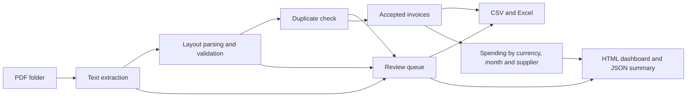

# Architecture and design decisions

## Business workflow

An operations analyst receives supplier invoices and needs a spreadsheet for
reviewing spending. The application turns a folder of supported PDF invoices
into validated records, a review queue, and an aggregated report in one command.

## Modules

| Module | Responsibility |
| --- | --- |
| `cli.py` | Parse command arguments, report batch results, return exit status |
| `extraction.py` | Read PDF text, recognize supported labels, validate required fields |
| `models.py` | Define invoice and review records shared by other modules |
| `pipeline.py` | Discover PDFs, isolate expected file failures, detect duplicates |
| `reporting.py` | Aggregate accepted records and write CSV, Excel, JSON, and HTML |
| `review.py` | Persist uploaded batches, validate decisions, and publish approved report snapshots |
| `review_app.py` | Serve the local review screen and HTTP endpoints |
| `templates/` and `static/` | PDF preview, correction form, batch navigation, and downloads |

Processing runs locally without external API calls or credentials. The CLI
requires no server. The browser review workflow starts a Flask server bound to
`127.0.0.1`; it is intended for one local user, not public hosting. Styles and
scripts are served locally. Neither workflow requires a database or paid API.

## Validation contract

One invoice per PDF is supported. All five business fields are required:
invoice number, supplier, invoice date, currency, and total. Dates must be valid
`YYYY-MM-DD` dates. Currency codes are normalized to uppercase and restricted
to SGD, USD, EUR, GBP, AUD, and CAD. Amounts must be positive, at most
999999999999.99, and have at most two decimal places. Commas must form groups
of three digits. Currency symbols, scientific notation, credit notes, and
European decimal-comma notation are excluded.

Each field must appear once on its own extracted-text line as `Label: value`.
Surrounding whitespace is removed, consecutive whitespace is collapsed, and
labels are matched without case sensitivity. Repeated fields are rejected
rather than selecting an arbitrary value. PDFs with encrypted content or any
page lacking extractable text are sent for review. A scanned page with a text
header may instead fail required-field validation; no OCR is attempted.

Only the first validation failure per file is reported. Unexpected programming
errors are allowed to fail the run rather than being mislabeled as bad invoices.

## Duplicate policy

The identity is the normalized supplier name plus invoice number, compared
without case sensitivity. After field validation, invoices are grouped by that
identity before any member is accepted. The group is evaluated as a whole:

- When every member agrees on date, currency, and total, the first file in
  filename order is retained. Later copies receive `duplicate_invoice`.
- When any member disagrees on date, currency, or total, every member receives
  `conflicting_duplicate` and the entire group is excluded from totals. This
  includes matching copies within the conflicting group. Review messages name
  the related files so the user can reconcile them.

Filename order therefore cannot choose the accepted amount for a conflicting
group. Other valid invoice groups continue to contribute to reports. Each
processed file appears once, either as an accepted invoice or a review issue.
Files that fail field validation retain their validation issue and do not
participate in duplicate grouping.

This assumes a supplier does not reuse invoice numbers within the batch. It
does not match supplier aliases, establish supplier legal identity, or remember
invoices from previous runs. To resolve a conflict in the command-line workflow,
verify the sources and rerun with a corrected input batch containing only the
authoritative invoice for that identity. Original documents can be retained
separately for reference.

## Monetary calculations and analysis

Amounts are parsed and summed using Python `Decimal`. CSV and JSON contain
amounts with two decimal places. Excel receives numeric cells for usability;
its numeric storage and display follow Excel's precision limits. Use the CSV
or JSON when exact textual decimal values are required.

Currencies are never combined or converted. Monthly spending uses the invoice
date; months with no accepted invoices are omitted. Supplier labels are grouped
without case sensitivity, retaining the first encountered spelling. Spending
means invoiced value, not paid cash flow or independently reconciled expense.

## Exports and repeatability

Every accepted row retains its source filename and detected layout. CSV text
that could be interpreted as a spreadsheet formula receives an apostrophe
prefix; Excel text cells are explicitly stored as strings. Dashboard text is
HTML-escaped. These protections keep extracted content from becoming formulas
or HTML markup in the generated reports.

Each CLI run rebuilds all five reports from the current input folder. Files are
generated in a temporary folder before replacement begins. Each individual
replacement is atomic on the same filesystem, but replacement of the complete
five-file set is not a filesystem transaction. Close open Excel workbooks before
rerunning. An interrupted replacement can leave a mixed report set; rerun the
batch before relying on it. A failed input scan leaves any previous reports in
place; check the command's exit status.

## Review decisions and persistence

The browser workspace copies uploads into a new batch. All records begin
pending, including successful extractions. Original fields, source PDFs, and
initial issue codes are preserved. Approval uses the existing date, currency,
and amount validation rules. Partial extraction pre-fills only unambiguous
fields. Unreadable, encrypted, or textless documents cannot be approved.

The service allows at most one approved record per normalized supplier and
invoice number, including after manual corrections. A flagged invoice or a
correction needs a note; rejection also needs a note. The bulk approval action
only accepts pending, unchanged, validated records with no already approved
identity. Corrected, reopened records require an explicit new approval.

Approved or rejected records must be reopened before their decisions can change.
Successful decisions increment a batch revision. Browser requests include the
revision they displayed, and stale requests fail with HTTP 409. A local file lock
serializes mutations; JSON is saved to a temporary file and replaced atomically.
Progress survives browser and server restarts. Decision timestamps record local
workflow events; this is not a tamper-proof audit trail or authenticated identity
system. The user with filesystem access controls the stored JSON and PDFs.

Review exports require a decision for every record. A fresh export directory
contains the five reports and `review_decisions.json`. Only after all files are
generated does the service register the completed snapshot for downloads. Existing
snapshots remain unchanged after corrections and are identified by the review
revision they captured. Downloads serve only registered snapshots and known
report filenames. A failed generation does not replace an earlier report set.

The browser workspace's default `.invoice-review/` folder is ignored by Git.
Upload names are sanitized; collisions are rejected. Requests have a batch size
limit, and mutations require a per-server token embedded in the local review
page. Host checks restrict requests to localhost. The development server has
debug mode disabled. These constraints support a local tool; deployment for
multiple users would need authentication, authorization, storage policies, and
a production server.

## Verification scope

The test suite checks both layouts, known reference values, validation errors,
encrypted documents, duplicate conflicts, currency separation, spreadsheet and
HTML escaping, reruns, and CLI exit statuses.

There are two fixture sources. `data/samples/` is generated by ReportLab from
the demo's reference CSV. `data/evaluation/` is separately authored using
explicit PDF text streams written with pypdf, with its expected outcomes stored
in a separate JSON file. Its builder reads neither expected results nor the
demo CSV, and automated tests read the committed PDF files directly.

`python -m tools.evaluate` exercises text extraction and field validation for
each evaluation PDF. It checks accepted values and rejected reason codes;
duplicate grouping and report aggregation remain covered by the batch tests.
The evaluator checks the PDF inventory against the expected cases before
scoring it. Missing, extra, or malformed cases cannot silently disappear from
the denominator. Expected valid documents contribute five business fields each,
including when a parsing regression incorrectly rejects the document. Layout
and source filename are checked separately from the business-field score.

The evaluation code also has regression tests that deliberately introduce
incorrect extraction and rejection results. A passing report requires correct
values and behavior for every case, rather than a high average score alone.

Both sets are synthetic and were developed with AI assistance. This separation
provides a check beyond the demo generator; it does not establish accuracy on
unseen supplier layouts, independent human validation, or OCR performance.

## Possible extensions

Add new suppliers as explicit layout adapters with independent sample fixtures.
OCR would require a separate extraction path and review criteria. Persistent
deduplication would require a store and a decision about invoice identity.
Payment reconciliation would require payment records and matching rules. Each
extension changes the input contract and should include its own verification.
